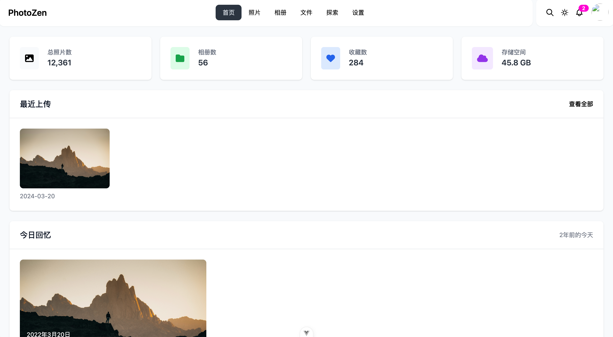

# PhotoZen
记录生活之美，留住珍贵时刻 —— 1Monent

Music tag web 作者的 NAS相册管理软件
## 项目结构

```
1Moment/
├── moment/                 # Django后端项目
│   ├── db.sqlite3         # SQLite数据库文件
│   ├── manage.py          # Django项目管理脚本
│   ├── photos/            # 照片管理应用
│   │   ├── models.py      # 数据模型
│   │   ├── api.py        # API接口
│   │   └── migrations/    # 数据库迁移文件
│   └── moment/            # Django项目配置目录
│
└── web/                   # Vue3前端项目
    ├── public/            # 静态资源目录
    ├── src/              # 源代码目录
    │   ├── components/   # Vue组件
    │   │   ├── PhotoUpload.vue    # 照片上传组件
    │   │   └── PhotoGrid.vue      # 照片网格展示组件
    │   └── assets/       # 静态资源
    │       └── main.css  # 全局样式（包含Tailwind配置）
    ├── index.html        # 入口HTML文件
    ├── package.json      # 项目依赖配置
    ├── tailwind.config.js # Tailwind CSS配置
    └── vite.config.ts    # Vite构建工具配置
```

## 技术栈

### 后端
- Django 4.2.19（REST API框架）
- django-ninja 1.3.0（OpenAPI文档生成）
- Pillow 10.3.0（图像处理）
- SQLite（开发环境数据库）
- python-magic 0.4.27（文件类型校验）

### 前端
- Vue 3.4.21（组合式API）
- TypeScript 5.3.3
- Vite 5.2.0（构建工具）
- Tailwind CSS 3.4.3（原子化CSS）
- DaisyUI 4.7.2（UI组件库）
- Heroicons 2.1.1（图标库）
- Axios 1.6.7（HTTP客户端）
- vue-router 4.3.0（路由管理）

## 功能实现

### 后端API接口
1. 照片管理
   - POST /api/photos/upload - 上传照片
   - GET /api/photos - 获取照片列表
   - GET /api/photos/{photo_id} - 获取照片详情

2. 相册管理
   - POST /api/albums - 创建相册
   - GET /api/albums - 获取相册列表
   - POST /api/photos/{photo_id}/albums/{album_id} - 添加照片到相册

3. 标签管理
   - POST /api/tags - 创建标签
   - GET /api/tags - 获取标签列表
   - POST /api/photos/{photo_id}/tags/{tag_name} - 为照片添加标签

### 前端组件
1. PhotoUpload组件
   - 支持拖拽上传
   - 支持多文件上传
   - 实时上传进度显示
   - 支持取消上传

2. 样式框架
   - 使用Tailwind CSS实现响应式布局
   - 使用DaisyUI组件库美化界面
   - 自定义组件样式类
     ```css
     .card-photo - 照片卡片样式
     .photo-grid - 响应式照片网格布局
     .btn-primary - 主要按钮样式
     ```

## 开发进度
1. ✅ 后端框架搭建
   - 完成数据模型设计（Photo、Album、Tag）
   - 实现基础API接口
     - 照片上传与管理
       ✅ POST /api/photos/upload 文件上传接口
       ✅ GET /api/photos 分页获取照片列表
       ✅ GET /api/photos/{photo_id} 照片元数据获取
     - 相册创建与管理
       ✅ POST /api/albums 相册创建
       ✅ GET /api/albums 相册列表查询
     - 标签管理
       ✅ POST /api/tags 标签创建
       ✅ GET /api/tags 标签列表查询
   - 配置媒体文件处理（支持JPG/PNG/HEIC格式）
   - 自动生成三种尺寸缩略图（128px/512px/1024px）

2. ✅ 前端框架搭建
   - 集成Vue3 + TypeScript开发环境
   - 配置Tailwind CSS + DaisyUI组件库
   - 实现功能路由配置
     - 首页展示最新照片 (/)
     - 带分类筛选的照片墙 (/photos)
     - 支持拖拽的文件上传页 (/upload)
     - 关于页面包含技术栈说明 (/about)

3. ✅ 已完成功能
   - 照片上传组件
     ✅ 拖拽上传/文件选择器双模式
     ✅ 多文件并发上传（最大10个）
     ✅ 实时进度条显示（基于axios拦截器）
     ✅ 上传成功自动刷新照片列表
   - 照片网格展示组件
     ✅ 响应式布局（2-4列自适应）
     ✅ 懒加载图片（Intersection Observer）
     ✅ 点击查看大图（Modal弹窗）
   - 前后端API对接
     ✅ 配置Vite代理解决跨域
     ✅ 封装axios请求模块
     ✅ 全局错误处理拦截器

4. ⏳ 待开发
   - 用户认证系统
   - 照片编辑功能
   - 照片搜索功能
   - 照片EXIF信息展示
   - 照片地理位置展示
   - 批量操作功能
   - 分享功能

# 用户截图


# DOCKER 打包
docker build -f compose/django/Dockerfilearm -t xhongc/photozen:latest .    
docker-compose -f ./compose/django/compose.yml up                       